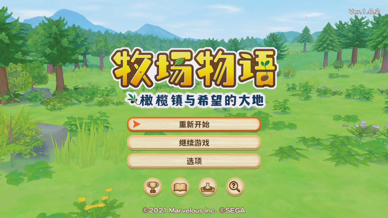
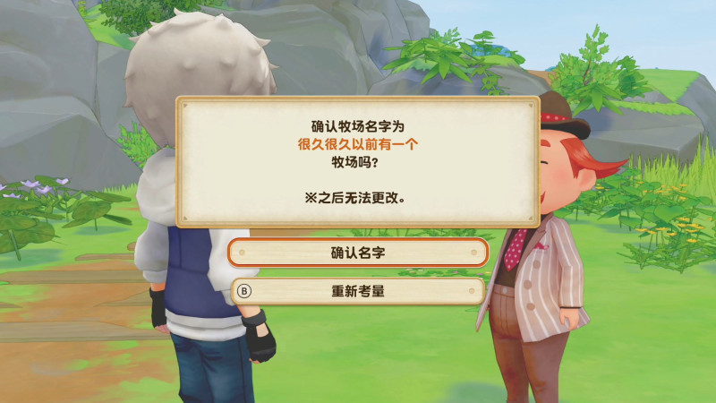

# 游戏开始

## 难易度设定

### 普通模式

左右在轻松模式中提供的而辅助将不会生效。
可以深度的体验游戏。

### 休闲模式

- 提高出货量，更容易获取金钱。
- 玩家的体力消耗变慢。
- 更容易提高友好度。
- 增加技能经验值的而获取量。
- 商店的商品售价变低。

## 捏脸系统

- 面容
- 肤色
- 右眼颜色
- 左眼颜色
- 发型
- 发色
- 人声
- 服装
- 动作

随便捏，随着小镇的发展，可以在小镇的服装店&美容院进行调整。

## 摩托车颜色

摩托车的颜色在剧情展开修好后，可以在工具店进行调整。

## 到达小镇后

到达小镇后，镇长会问你一些问题，来确定你的名字、生日、性别、以及牧场的名字。

※ 主人公的姓名、生日、性别，以及牧场的名字是决定以后无法更改的，请慎重。
