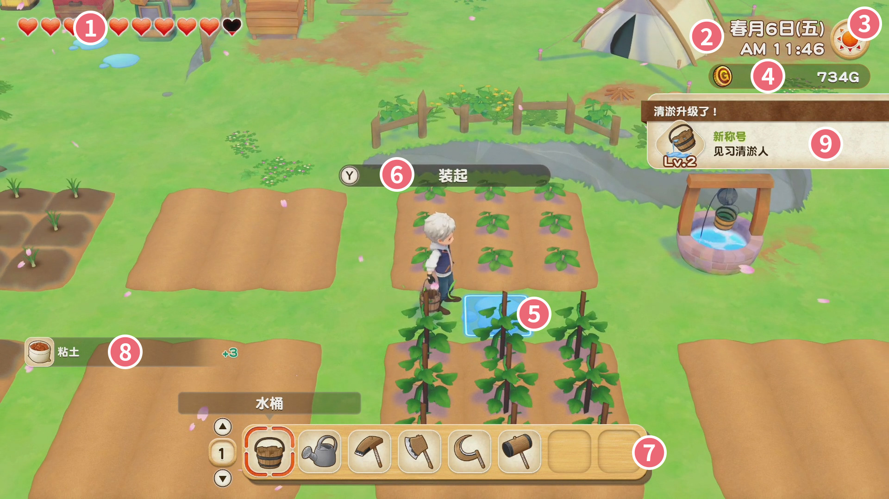
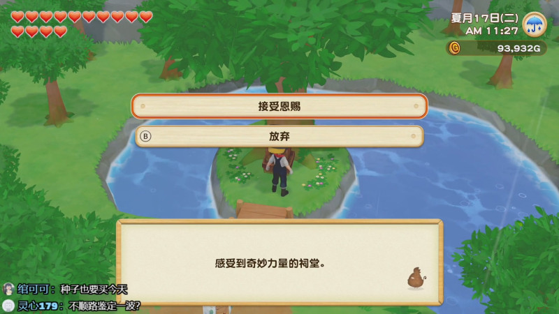

# 基础知识

## 游戏界面的介绍

① 主人公的体力
② 当前时间
③ 当前天气
④ 持有的金钱
⑤ 游标
⑥ 动作显示
⑦ 道具栏
⑧ 获得物品提示
⑨ 成就通知

## 记事本（按X键打开的菜单）

- 状态：记录游戏的一些数据，使用相机拍摄的照片也可以在这里查看。
- 背包：X键打开后直接显示的就是背包。锤子、镰刀等道具可以收入工具袋内，不占用背包的格子，但是使用时需要将道具从工具袋内拿出。
- 技能：显示技能等级与当前的经验值。
- 加工：显示可以加工的道具，可以查看加工需要的材料等信息。
- 居民信息：可以查看居民的好感度信息，当日赠送礼物信息，也是唯一可以看到居民立绘的地方。
- 日历：可以查看居民的生日、节日等信息。
- 地图：小镇的地图，实时显示居民的位置。左下角的「设施信息」可以查看每家店的营业时间与休息日。

### 背包的操作

A键可以抓取物品。
Y键可以选择放置于地面或食用料理。
X键可以选择数量后抓取。

※ 在背包内吃料理可以节约时间。

### 扩大背包的容量

背包初始只有2栏，每栏8格，共16格。
可在工具店扩大背包的容量。
第一次升级需要花费3000G，升级后为3栏（24格）。
第二次升级需要15000G，升级后为4栏（32格）。

## 菜单（按+键打开的菜单）

- 保存：可以随时存档。
- 读取：可以随时读档。
- 选项：调整游戏的BGM、镜头、联网等设置与难易度设置。
- 帮助：查看游戏的帮助。
- 返回标题：返回标题画面。
- 关闭：关闭菜单。

※ 可以很方便的随时调整游戏的难易度。

## 时间与日期

一年中有春、夏、秋、冬这四个月，每个月都有28天。
每天有24小时，但实际可以活动的时间只有起床后至次日的2点之前。
无论在室内或是室外，时间都会流逝。

## 天气的影响

晴天：一年中的大部分天气，没有特别的影响。
雨天：冬天以外的季节发生，无法放牧，无法带宠物散步，不需要给作物浇水。
台风：仅在夏天发生，在屋外使用道具体力消耗更大，其余和雨天相同。
雪天：仅在冬天发生，无法放牧，无法带宠物散步，不需要给作物浇水。
大雪：仅在冬天发生，在屋外使用道具体力消耗更大，其余和雪天相同。

## 体力相关

使用道具会消耗体力，并且体力是根据道具的实际效果消耗的。
蓄力后，只割一格的草，与不蓄力割一格的草，消耗的体力是一样的。
如果空挥，则不会消耗体力。
体力耗尽后会晕倒，直接到第二天早上。

体力的初始值为10颗♥，上限为20颗♥。
（食用料理可临时突破当前上限）

### 回复体力的方法

- 睡觉
- 去小酒馆或咖啡厅吃饭
- 吃料理
- 洗澡（不住帐篷之后）

#### 睡觉时间与回复体力的关系

睡觉时间|起床时间|体力回复量
-|-|-
AM6:00~PM9:59|AM6:00|体力完全回复
PM10:00~PM10:59|AM7:00|体力最大值的81~90%
PM11:00~PM11:59|AM8:00|体力最大值的64~72%
AM12:00~AM12:59|AM9:00|体力最大值的56~63%
AM1:00~AM1:59|AM10:00|体力最大值的48~54%

※ 不要卡点睡觉，PM11:59在床前按A键睡觉，上床的动作仍会消耗时间，导致实际入睡时间为AM12:00以后。

### 提高体力上限的方法

- 在精灵祠堂进行祈祷，接受精灵的恩赐
「增加体力上限」需要可乐嘭发现点数10点
「额外增加体力上限」需要可乐嘭发现点数20点
「再次增加体力上限」需要可乐嘭发现点数40点
- 熔岩洞窟的小游戏得分4000分以上
- 豆藤岛的小游戏得分55点以上
